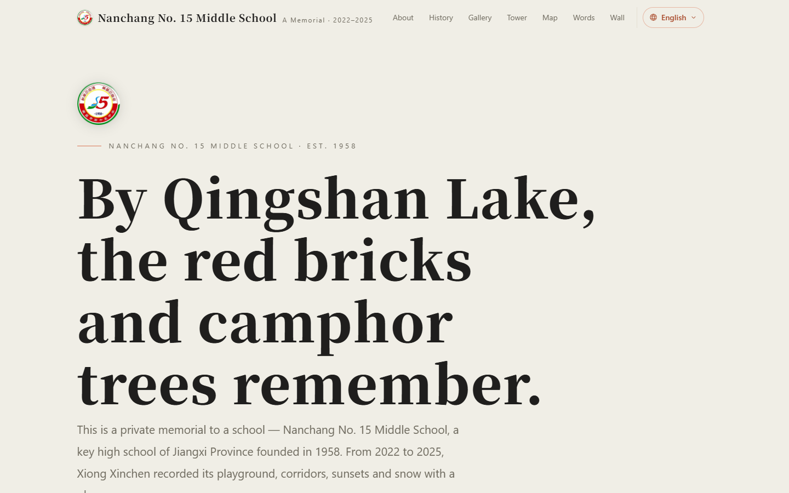
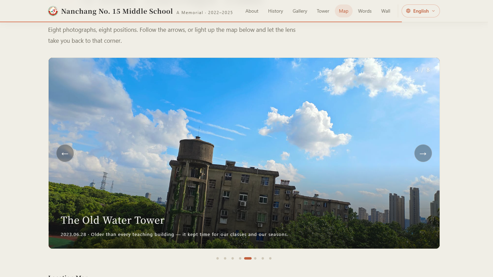
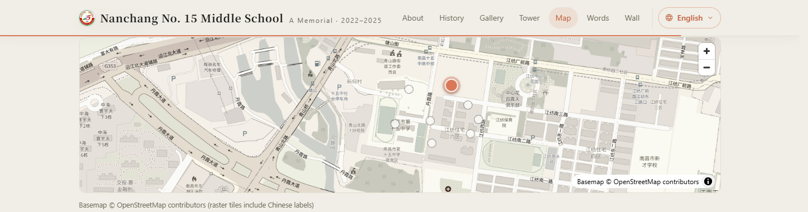
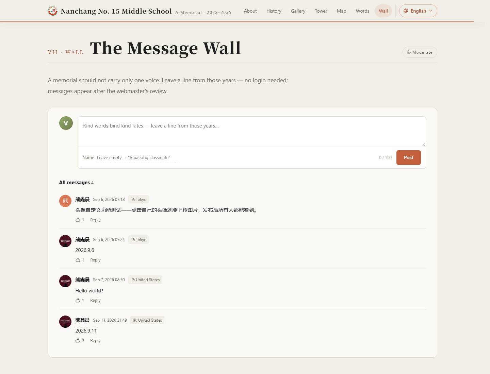

<sub>🌐 <a href="README.md">中文</a> · <b>English</b></sub>

<div align="center">

# Memorial by Qingshan Lake

> *"The alma mater is the campus you only start to miss after you've left it."*

[](https://xxc2007.me)
[](LICENSE)
[](#️-tech-stack)
[](#-guestbook)
[](https://github.com/xxc2007)
[](https://x.com/xxc2007)
[](https://www.youtube.com/@xxc2007)

<br>

**A private memorial of one school — putting three years of time at an address you can always return to.**

<br>

This is a memorial page for Nanchang No. 15 Middle School: **25 photographs of the campus**, a **photo tour with a clickable Chinese-labeled location map (MapLibre GL)**, a **login-free anonymous guestbook**, and a full set of interactions polished for reading — reading progress bar, section-aware navigation, count-up numbers, a growing timeline, and a zoom-and-pan lightbox.

Pure HTML / CSS / vanilla JS with structure, style and behavior separated (`index.html` + `assets/`) — zero frameworks, no build step.

[Live Site](https://xxc2007.me) · [Structure](#-site-structure) · [Highlights](#-highlights) · [Tech Stack](#️-tech-stack) · [Run Locally](#-run-locally) · [Migration guide](docs/MIGRATION.en.md)

</div>

---

<p align="center">
  
</p>

---

## 🎬 The memorial, cut into a return path

This 35-second promo turns the real page into one short viewing path: the emblem and hero first, then the history timeline, 25 campus photographs, the water tower across day and night, an eight-spot campus map, and a privacy-safe guestbook demo before the whole memorial comes back together. It uses real page captures and campus photography, with a restrained rhythmic score and paper-like transitions.

<p align="center">
  <strong>Native README player · click the controls to play (no login required)</strong>
</p>

<video controls width="100%" src="https://raw.githubusercontent.com/xxc2007/In-memory-of-Nanchang-No.-15-Middle-School/main/docs/promo/nanchang15-promo-readme.mp4"></video>

<p align="center"><sub>
  720p README preview with the full soundtrack · <a href="https://xxc2007.me/promo/">Open the HD player</a> · <a href="https://raw.githubusercontent.com/xxc2007/In-memory-of-Nanchang-No.-15-Middle-School/main/docs/promo/nanchang15-promo.mp4">Open the 1080p MP4 directly</a>
</sub></p>

<p align="center">
  <a href="https://xxc2007.me/promo/">
    
  </a>
</p>

<p align="center">
  <a href="https://xxc2007.me/promo/">▶ Open the HD promo</a> · <a href="https://xxc2007.me">Open the live memorial</a>
</p>

---

## ✨ Highlights

### 📖 The memorial itself

- **Seven sections**: School Overview → History → Campus Gallery (25 photographs in six themed groups) → The Water Tower → Campus Map → Epilogue → Guestbook
- **Ten languages**: a globe-icon dropdown in the top bar (modelled on AMD's site: the menu lists 简体中文 / 繁體中文 / English / 日本語 in each language's own script, with a check on the current one) — the whole block carries `translate="no"` so bilingual translation extensions cannot expand it the way they used to blow the old single-character pills out of the viewport; `/` (Simplified Chinese), `/zh-Hant/` (Traditional), `/en/` (English), `/ja/` (Japanese), `/ko/` (한국어), `/ru/` (Русский), `/es/` (Español), `/fr/` (Français), `/pt/` (Português), `/ar/` (العربية); all ten pages carry mutual hreflang + sitemap alternates; dynamic copy in the tour, map and guestbook follows the page language, and all ten versions share one message wall
- Claude visual language: cream paper background + terracotta accents + serif headlines, with consistent hairlines and rounded cards throughout
- Fully responsive (three breakpoints), a print-for-binding stylesheet, and a `prefers-reduced-motion` fallback

### 🗺 Campus Tour (photo tour + MapLibre location map)

- The school is pinned to OSM way `260420791` (Qingshanhu campus, 28.7208°N, 115.9322°E)
- **Full-frame photo tour**: 8 spots, 8 photographs, switchable via arrows/dots/keyboard, with a slow Ken Burns push
- **Chinese-labeled location map**: OSM raster basemap, 8 markers linked with the tour — click a marker and the camera flies there
- MapLibre loads on demand as you scroll near the map section; all spots live in one `SPOTS` array in `assets/map.js` — easy to edit

<p align="center">
  
</p>
<p align="center"><sub>
  ▲ A Tour Through Time · The Old Water Tower spot (5 / 8) with Ken Burns push and English caption
</sub></p>

<p align="center">
  
</p>

### 💬 Guestbook (self-hosted Artalk)

- **No login required**: leave a message without filling in nickname or email — the frontend fills in an anonymous identity automatically (same nickname, same identity)
- **Moderated**: new messages enter a pending queue and only appear after the site owner approves them
- Zero third-party dependency: the Artalk server runs on our own machine, the data stays ours

<p align="center">
  
</p>

### 🎬 Interactions (vanilla JS, zero dependencies)

| Interaction | Details |
|------|------|
| Reading progress | A terracotta hairline under the top bar, `scaleX` follows scroll |
| Language menu | Globe button opens the language dropdown: `Esc` closes, `↑↓`/`Home`/`End` move between options, clicking outside dismisses; falls back to a static pill row without JS |
| Nav highlight | Scrollspy lights up the current section |
| Count-up numbers | Hero key numbers 0 → 1958 / 51 / 2600+ / 25 with easeOutQuart |
| Hero parallax | The hero image drifts at half scroll speed, `scale(1.09)` hides the edges |
| Growing timeline | The history line draws itself downward; year nodes light up as it passes |
| Lightbox | Cursor-centered wheel zoom 1–4×, double-click zoom, drag pan, pinch, clamped edges — coexists safely with swipe navigation |
| Gallery fade & tilt | Images fade in as they load; desktop cards tilt subtly with the cursor |

All animations share a single rAF-driven scroll loop and degrade gracefully when the system asks for reduced motion.

## 🗂 Site structure

```text
site/
├── index.html          # Simplified Chinese page (only two inline scripts: JSON-LD and the map lazy-loader)
├── zh-Hant/index.html  # Traditional Chinese page (Taiwan usage: 暱稱/登入/載入/網路/郵遞區號)
├── en/index.html       # English page (assets shared via ../ relative paths, file:// friendly)
├── ja/index.html       # Japanese page (natural phrasing: おわりに, 通りすがり, メッセージウォール…)
├── ko/index.html       # Korean page (natural Korean: 기념 앨범, 지나가던 학생, 방명록…)
├── ru/index.html       # Russian page (natural Russian phrasing throughout)
├── es/index.html       # Spanish page (idiomatic Spanish, not machine-translated)
├── fr/index.html       # French page (idiomatic French formulations)
├── pt/index.html       # Portuguese page (idiomatic Portuguese expressions)
├── ar/index.html       # Arabic page (full RTL layout with Arabic font stacks)
├── 404.html            # Self-contained 404 page (inline styles, zero external requests; links to the other nine languages)
├── assets/
│   ├── style.css       # Site-wide styles (tokens, components, breakpoints, print, fallbacks)
│   ├── main.js         # Main interactions: progress, scrollspy, parallax, inertia, lightbox
│   ├── map.js          # Photo tour + location map (lazy-loaded MapLibre; spot data in ten languages)
│   └── wall.js         # Guestbook (talks to self-hosted Artalk; dynamic copy in ten languages follows <html lang>)
├── images/
│   ├── full/           # 25 full-size photographs (plus 4 spare shots: 10/22/23/25, not yet exhibited)
│   ├── thumbs/         # Matching thumbnails
│   ├── og-card.jpg     # 1200×630 social share card (text-free — works for all languages)
│   └── emblem-*.png    # School emblem (top bar / hero / footer / favicon)
├── maplibre/           # Self-hosted MapLibre GL v5 (no CDN dependency)
├── docs/               # README screenshots + [migration guide](docs/MIGRATION.en.md)
│   └── promo/          # Public player page, 1080p master, and README preview (live at /promo/)
├── README.md / README.en.md   # Bilingual repository docs (this file and the Chinese original)
├── robots.txt / sitemap.xml / LICENSE / .gitattributes / .gitignore
```

## ⚙️ Tech stack

| Layer | Choice |
|------|------|
| Frontend | Pure HTML / CSS / vanilla JS, structure·style·behavior separated, no build |
| Map | [MapLibre GL](https://maplibre.org) v5 + OSM raster basemap (Chinese labels), lazy-loaded |
| Guestbook | [Artalk](https://artalk.js.org) v2.10 self-hosted + SQLite |
| Serving | nginx reverse proxy `/comment/` → systemd service |
| Deployment | Azure VM · Cloudflare DNS · Let's Encrypt |

## 🚀 Run locally

Nothing to install:

```bash
git clone https://github.com/xxc2007/In-memory-of-Nanchang-No.-15-Middle-School.git
cd In-memory-of-Nanchang-No.-15-Middle-School
python -m http.server 8000   # or any static server; open http://localhost:8000
```

> The guestbook needs the self-hosted Artalk service (`/comment/`); locally that area shows a load-failure notice while everything else works. Opening `index.html` directly via `file://` also works for browsing; only the map tiles and the guestbook need network.

## 📝 Design notes

- **Visual direction**: Claude / Anthropic visual language (cream paper + terracotta + serif), specified by the site owner at the very beginning; every iteration grows within this direction. The background stays a pure cream paper surface with no decorative layers — motion always yields to content.
- **Ten-language architecture**: ten static pages (`/` `/zh-Hant/` `/en/` `/ja/`) rather than runtime translation — each page owns its full semantic content and SEO metadata, mutually recognised via hreflang and sitemap alternates; `wall.js`/`map.js`/`main.js` switch dynamic copy by `<html lang>`, and all ten versions share one guestbook (same page_key), so messages in any language land on the same wall.
- **Desktop inertial scrolling is intentional**: the wheel is driven through inertial interpolation (Oryzo/Lusion feel), enabled only on fine-pointer devices; browser zoom (Ctrl+wheel), the map canvas, inputs and the lightbox are never hijacked, and touch devices / `prefers-reduced-motion` users keep native scrolling. Not a bug.
- **Browser support matrix**: modern evergreen browsers only (Chrome / Edge / Firefox / Safari, last two years). IE and Legacy Edge are explicitly unsupported; no polyfills.
- **Guestbook fetch cap**: at most 100 comments per request (plenty for a memorial page); the counter prefers the server-side total. All network requests carry a 15-second timeout fallback.
- **The 404 page keeps pill-style language links** on purpose: `404.html` is fully self-contained (zero external requests, inline styles), so pulling in the site dropdown would drag in JS and more CSS. Two forms coexist; usability is unaffected.
- **Spare shot pool**: `10-brick-building-court`, `22-running-track`, `23-library-gate` and `25-staff-lane` (in `images/full|thumbs`) are deliberately kept as spare material, not yet exhibited; reach for them first when adding or replacing photos.

## 📄 License

[MIT](LICENSE) © 2026 Xiong Xinchen (熊鑫晨) · Campus photographs © Xiong Xinchen

---

<div align="center">
  <sub>Dedicated to the red-brick buildings, the camphor trees and the old water tower by Qingshan Lake.<br><a href="https://xxc2007.me">xxc2007.me</a></sub>
</div>
