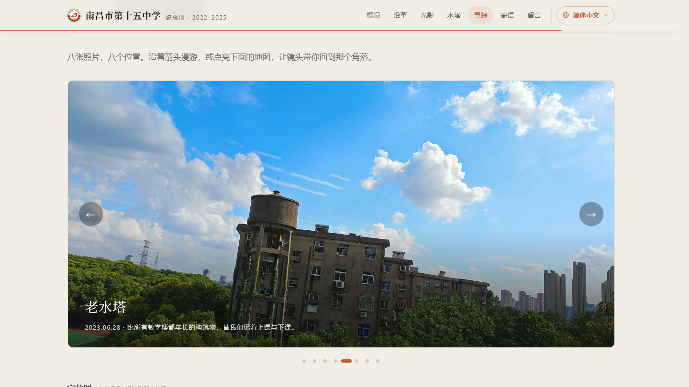

<sub>🌐 <b>中文</b> · <a href="README.en.md">English</a></sub>

<div align="center">

# 青山湖畔的纪念册

> *「所谓母校，就是那座你离开之后才开始无限怀念的校园。」*

[](https://xxc2007.me)
[](LICENSE)
[](#️-技术栈)
[](#留言墙artalk-自托管)

<br>

**把三年光阴放进一个可以随时回去的地址。**

<br>

这是南昌市第十五中学的纪念页：**25 张校园实景摄影**、一段**八个机位的时光漫游**、一张**中文定位图**与一面**无需登录的匿名留言墙**。

纯 HTML / CSS / Vanilla JS，结构·样式·行为三分离（`index.html` + `assets/`），零框架、无构建步骤。克隆下来，起个静态服务器就能打开。

[在线访问](https://xxc2007.me) · [特色](#-特色) · [站点结构](#-站点结构) · [技术栈](#️-技术栈) · [本地运行](#-本地运行) · [设计笔记](#-设计笔记)

</div>

---

<p align="center">
  
</p>
<p align="center"><sub>
  ▲ 首屏 · 米白纸感 + 赤陶橙 + 衬线大标题
</sub></p>

---

## ✨ 特色

### 📖 纪念册本体

- **七个章节**：概况 → 沿革 → 光影（25 张摄影，六个专题组）→ 水塔 → 寻踪 → 寄语 → 留言墙
- Claude 视觉语言：米白纸感底色 `#F0EEE6` + 赤陶橙 `#D97757` + 衬线标题，全站统一的发丝线与圆角卡片
- 完整响应式（三档断点）与 `prefers-reduced-motion` 降级

### 🗺 校园寻踪（时光漫游 + 定位图）

- **全幅照片漫游**：8 个机位、8 张全幅照片，箭头 / 圆点 / 键盘方向键切换，Ken Burns 缓推镜头
- **中文定位图**：OSM 栅格底图（含中文地名），8 个机位标记与漫游联动，点击标记镜头飞至该位置
- 滚动临近才按需加载 MapLibre，首屏零地图开销；机位数据集中在 `assets/map.js` 的 `SPOTS` 数组，一眼可改

<p align="center">
  
</p>
<p align="center"><sub>
  ▲ 伍 · MAP 时光漫游 · 老水塔机位 · 底部渐影字幕与 5/8 计数
</sub></p>

<p align="center">
  
</p>
<p align="center"><sub>
  ▲ 中文定位图 · 点击标记，漫游镜头飞至该位置 · 学校定位至 OSM way 260420791
</sub></p>

### 💬 留言墙（Artalk 自托管）

- **无需登录**：不填昵称邮箱也能留言，前端自动补全匿名身份（同昵称同身份）
- **先审后显**：新留言进入待审队列，站长在后台审核通过后才对外展示
- 零第三方依赖：Artalk 服务端跑在自己的服务器上，数据是自己的

<p align="center">
  
</p>
<p align="center"><sub>
  ▲ 柒 · WALL 留言墙 · 匿名留言 · 头像 / IP 属地 / 北京时间
</sub></p>

### 🎬 动态交互（原生 JS，零依赖）

| 交互 | 说明 |
|------|------|
| 阅读进度条 | 顶栏赤陶橙细线，`scaleX` 随滚动增长 |
| 导航高亮 | scrollspy 自动点亮当前章节 |
| 数字滚动 | 首屏关键数字 0 → 1958 / 51 / 2600+ / 25，easeOutQuart |
| 大图视差 | 首图以 0.5× 速率反向移动 + 光标惯性视差，`scale(1.09)` 防露边 |
| 惯性平滑滚动 | 桌面滚轮接管为惯性插值（Oryzo 手感），触屏 / 地图 / 灯箱不劫持 |
| 时间线生长 | 沿革竖线随滚动画下，经过的年份节点依次点亮 |
| 灯箱 | 滚轮以光标为中心缩放 1–4×、双击放大、拖拽平移、双指捏合、边界钳制 |
| 画廊渐显与微倾 | 图片加载后柔和渐显；桌面端卡片随光标 3D 微倾 |

所有动画共用一个 rAF 驱动的滚动循环，并在系统开启「减弱动态效果」时整体降级。

## 🗂 站点结构

```text
site/
├── index.html          # 页面结构（语义 HTML，无内联样式/脚本）
├── assets/
│   ├── style.css       # 全站样式（设计令牌 + 组件 + 响应式 + 降级）
│   ├── main.js         # 主交互：进度条/scrollspy/视差/惯性滚动/灯箱
│   ├── map.js          # 时光漫游 + 定位图（MapLibre，按需加载）
│   └── wall.js         # 留言墙（对接自托管 Artalk）
├── images/
│   ├── full/           # 25 张全幅摄影
│   ├── thumbs/         # 对应缩略图
│   └── emblem-*.png    # 校徽（顶栏 / 首屏 / 页脚 / favicon）
├── maplibre/           # MapLibre GL v5 自托管（不依赖 CDN）
└── docs/               # README 展示截图
```

## ⚙️ 技术栈

| 层 | 选型 |
|------|------|
| 前端 | 纯 HTML / CSS / Vanilla JS，结构·样式·行为三分离，零框架无构建 |
| 地图 | [MapLibre GL](https://maplibre.org) v5 + OSM 栅格底图（自托管，不依赖 CDN） |
| 留言 | [Artalk](https://artalk.js.org) v2.10 自托管 + SQLite |
| 服务 | nginx 反向代理 `/comment/` → systemd 常驻 |
| 部署 | Azure VM · Cloudflare DNS · Let's Encrypt |

## 🚀 本地运行

无需安装任何东西：

```bash
git clone https://github.com/xxc2007/In-memory-of-Nanchang-No.-15-Middle-School.git
cd In-memory-of-Nanchang-No.-15-Middle-School
python -m http.server 8000   # 或任意静态服务器；浏览器打开 http://localhost:8000
```

> 留言墙依赖自托管的 Artalk 服务（`/comment/`），本地打开时该区域会提示加载失败，其余功能完整可用。直接双击 `index.html`（file://）也可浏览，仅定位图瓦片与留言墙需要网络。

## 📝 设计笔记

- **视觉方向**：Claude / Anthropic 视觉语言（米白纸感 + 赤陶橙 + 衬线），由站长在项目之初指定，此后所有迭代都在这个方向上生长。背景保持纯净的米白纸面，不加任何装饰层——动效永远让位于内容。
- **桌面惯性滚动是刻意设计**：滚轮经惯性插值驱动（Oryzo/Lusion 手感），仅在精确指针设备启用；浏览器缩放（Ctrl+滚轮）、地图画布、输入框与灯箱均不劫持，触屏与 `prefers-reduced-motion` 用户走原生滚动。这不是 bug。
- **浏览器支持矩阵**：面向现代常青浏览器（Chrome / Edge / Firefox / Safari 近两年版本），明确不支持 IE 及 Legacy Edge，全站无 polyfill。
- **留言墙拉取上限**：单次最多取 100 条（纪念册体量足够），计数优先展示服务端真实总数；网络请求统一带 15 秒超时兜底。

## 📄 License

[MIT](LICENSE) © 2026 熊鑫晨（Xiong Xinchen）· 校园实景摄影 © 熊鑫晨

---

<div align="center">
  <sub>献给青山湖畔的红砖楼、香樟与老水塔。<br><a href="https://xxc2007.me">xxc2007.me</a></sub>
</div>
