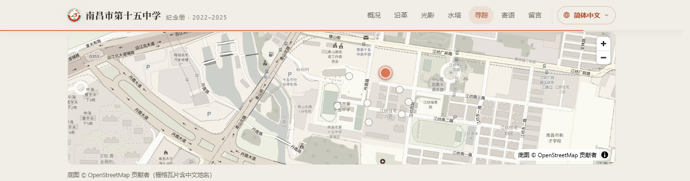
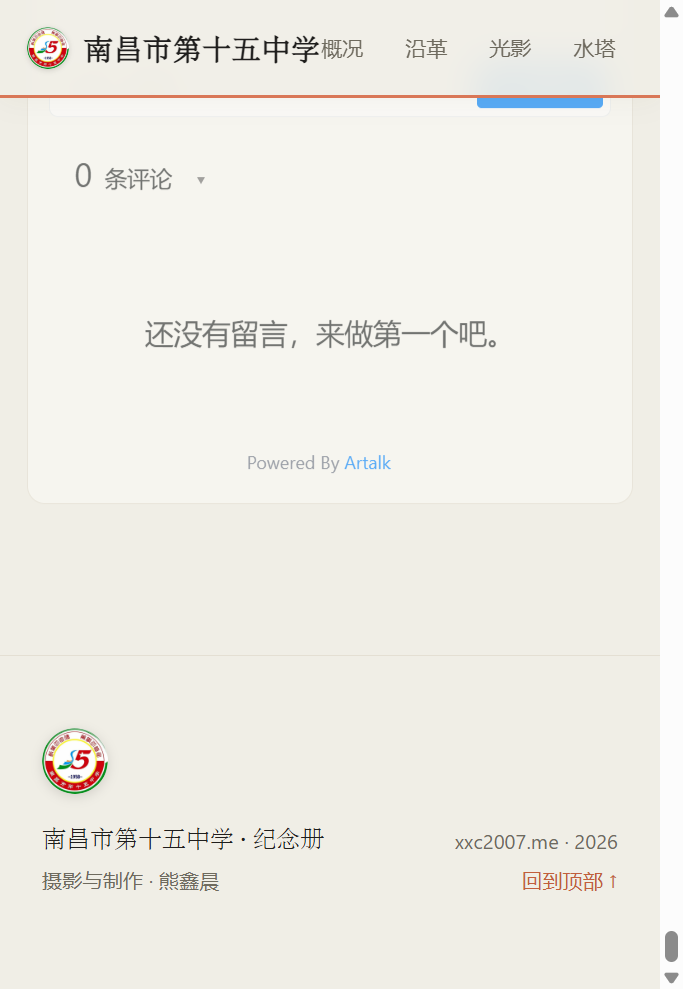

<sub>🌐 <b>中文</b> · <a href="README.en.md">English</a></sub>

<div align="center">

# 青山湖畔的纪念册

> *「所谓母校，就是那座你离开之后才开始无限怀念的校园。」*

[](https://xxc2007.me)
[](LICENSE)
[](#️-技术栈)
[](#留言墙)

<br>

**一座校园的私人纪念册——把三年光阴放进一个可以随时回去的地址。**

<br>

这是南昌市第十五中学的纪念页：**27 张校园实景摄影**、一座**可以点击机位的 Leaflet 校园地图**、一面**无需登录的匿名留言墙**，以及一整套为阅读体验打磨的动态交互——阅读进度条、章节导航高亮、数字滚动、时间线生长、可缩放平移的灯箱。

单文件 · 零框架 · 无构建步骤。克隆下来，双击就能打开。

[在线访问](https://xxc2007.me) · [站点结构](#-站点结构) · [特色](#-特色) · [技术栈](#️-技术栈) · [本地运行](#-本地运行)

</div>

---

<p align="center">
  
</p>

---

## ✨ 特色

### 📖 纪念册本体

- **七个章节**：学校概况 → 沿革纪要 → 校园光影（25 张摄影，六个专题组）→ 一座水塔的记忆法 → 校园寻踪 → 寄语 → 留言墙
- Claude 视觉语言：米白纸感底色 + 赤陶橙强调 + 衬线标题，全站统一的发丝线与圆角卡片
- 完整响应式（三档断点）与 `prefers-reduced-motion` 降级

### 🗺 校园寻踪（Leaflet）

- 学校精确定位至 OSM way `260420791`（青山湖校区，28.7208°N, 115.9322°E）
- **8 个照片机位标注**，弹窗内嵌对应照片缩略图与拍摄日期；机位数据集中在 `CAMERA_SPOTS` 数组，一眼可改
- OSM 免费瓦片 + CSS 滤镜统一成站内色调；`scrollWheelZoom: false` 不劫持页面滚动

<p align="center">
  
</p>

### 💬 留言墙（Artalk 自托管）

- **无需登录**：不填昵称邮箱也能留言，前端自动补全匿名身份（同昵称同身份）
- **先审后显**：新留言进入待审队列，站长在后台审核通过后才对外展示
- 零第三方依赖：Artalk 服务端跑在自己的服务器上，数据是自己的

<p align="center">
  
</p>

### 🎬 动态交互（原生 JS，零依赖）

| 交互 | 说明 |
|------|------|
| 阅读进度条 | 顶栏赤陶橙细线，`scaleX` 随滚动增长 |
| 导航高亮 | scrollspy 自动点亮当前章节 |
| 数字滚动 | 首屏关键数字 0 → 1958 / 51 / 2600+ / 25，easeOutQuart |
| 大图视差 | 首图以 0.5× 速率反向移动，`scale(1.09)` 防露边 |
| 时间线生长 | 沿革竖线随滚动画下，经过的年份节点依次点亮 |
| 灯箱 | 滚轮以光标为中心缩放 1–4×、双击放大、拖拽平移、双指捏合、边界钳制，与滑动翻页手势互斥 |

所有动画共用一个 rAF 驱动的滚动循环，并在系统开启「减弱动态效果」时整体降级。

## 🗂 站点结构

```text
site/
├── index.html          # 全部页面、样式与脚本（单文件）
├── images/
│   ├── full/           # 25 张全幅摄影
│   ├── thumbs/         # 对应缩略图
│   └── emblem-*.png    # 校徽（顶栏 / 首屏 / 页脚 / favicon）
├── leaflet/            # Leaflet 1.9.4 自托管（不依赖 CDN）
└── docs/               # README 展示截图
```

## ⚙️ 技术栈

| 层 | 选型 |
|------|------|
| 前端 | 纯 HTML / CSS / Vanilla JS，单文件无构建 |
| 地图 | [Leaflet](https://leafletjs.com) 1.9.4 + OpenStreetMap 瓦片 |
| 留言 | [Artalk](https://artalk.js.org) v2.10 自托管 + SQLite |
| 服务 | nginx 反向代理 `/comment/` → systemd 常驻 |
| 部署 | Azure VM · Cloudflare DNS · Let's Encrypt |

## 🚀 本地运行

无需安装任何东西：

```bash
git clone https://github.com/xxc2007/nanchang15-memorial.git
cd xxc
python -m http.server 8000   # 或直接双击 index.html
```

> 留言墙依赖自托管的 Artalk 服务（`/comment/`），本地打开时该区域会提示加载失败，其余功能完整可用。

## 📄 License

[MIT](LICENSE) © 2026 熊鑫晨（Xiong Xinchen）· 校园实景摄影 © 熊鑫晨

---

<div align="center">
  <sub>献给青山湖畔的红砖楼、香樟与老水塔。<br><a href="https://xxc2007.me">xxc2007.me</a></sub>
</div>
